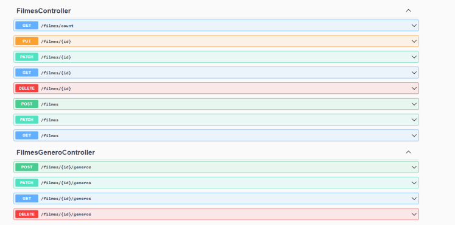
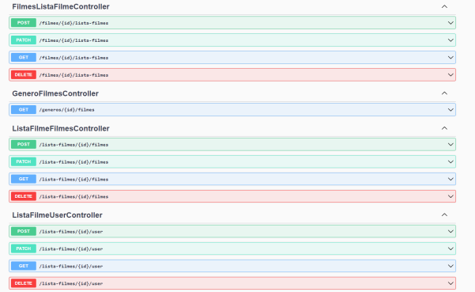

# M3 - Desenvolvimento Web I

Neste repositório está o projeto desenvolvido para a disciplina 'Desenvolvimento Web I', uma disciplina de segundo ano do curso de informática da Universidade da Maia. Desenvolvido pelo Grupo _01_: [@AnaAzevedo](https://github.com/AnaAzevedo2), [@MarianaLopes](https://github.com/marlope02), [@MarioRodrigues](https://github.com/MarioRodrigues2304).

## Tema 

Este trabalho tem como âmbito o desenho e criação de um serviço web que permite a consulta de informação de filmes.

## Organização do repositório 

_O repositório está organizado da seguite maneira:_
* **Source code** está no [src folder](src/).
* Capítulos do relatório estão no [doc folder](doc/).

## Galeria 

## Tecnologias 

_As tecnologias usadas neste projeto, foram as seguites:_
* Javascript
* HTML
* TypeScript
* Shell
* Docker

### Frameworks e Livrarias 

* Docker
* NodeJS
* Loopback4
* React-Admin

## Relatório
_Estão adicionados um documento por capítulo_

### Apresentação do projeto
* Capítulo 1: [Apresentação do projeto](doc/c1.md)
### Recursos
* Capítulo 2: [Recursos](doc/c2.md)
### Produto
* Capítulo 3: [Produto](doc/c3.md)
### Apresentação
* Capítulo 4: [Apresentação](doc/c4.md)

## Grupo _01_
* Ana Filipa Azevedo [@AnaAzevedo](https://github.com/AnaAzevedo2) 
* Mariana Lopes [@MarianaLopes](https://github.com/marlope02) 
* Mário Rodrigues [@MarioRodrigues](https://github.com/MarioRodrigues2304)

