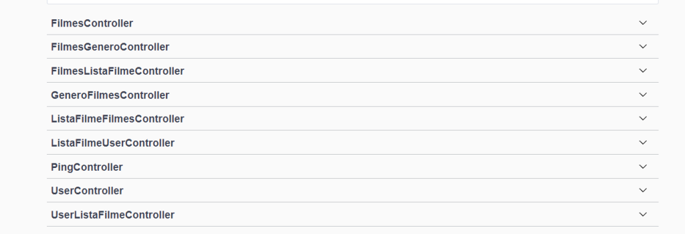

# C2 : Recursos ------------------------ VER !!!

_Cada recurso apresenta diferentes verbos do protocolo HTTP (GET, POST, DELETE, PUT, PATCH)._
_Nesta API estão presentes 9 tipos de recursos diferentes:_

* FilmesController
> Dentro deste recurso estão presentes diferentes tipos de verbos. Um GET que mostra o filme por id, um DELETE que ilimina um filme através da escola de um id, etc. 

* FilmesGeneroController
> Este recurso é uma relação entre os filmes e gênero, isto é, quando se vê a informação de um filme o gênero que vai apresentar será o id correspondente da tabela gênero.

* FilmesListaFilmesController
> Este recurso é utilizado fornecendo um filme e com isso poderemos saber em que lista é que o mesmo se encontra.

* GeneroFilmesController
> Este recurso é uma relação entre os géneros e filmes, isto é, quando se vê a informação de um género o filme que vai apresentar será o id correspondente da tabela filme.

* ListaFilmeFilmesController
> Depois de estar dentro de uma lista será possivel escolher os filmes que se querem colocar dentro dessa mesma lista.

* ListaFilmeUserController
> Dentro da lista de um User pode-se escolher um ou mais filmes para colocar dentro de uma lista.

* PingController
> Temos a obtenção do ping.

* UserController
> Mostra a informação do user pelo id.

* UserListaFilmeController
> ???Dentro da lista de um User pode-se escolher um ou mais filmes para colocar dentro de uma lista.

---
[< Previous](c1.md) | [^ Main](../../../) | [Next >](c3.md)
:--- | :---: | ---: 
