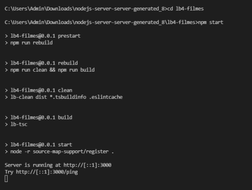

# C3 : Produto

## 3.1 Desenvolvimento 

O nosso produto pode ser usado apartir da linha de comandos ou docker. Como se criou um multicontainer, isto é, um container mais do que duas imagens e nesse colocamos, como imagem, o node.js e a nossa database em MySQL, o produto pode ser acessado a partir do mesmo container

## 3.2 Instalação -------------------- VER !!!!

_Fazer download da pasta main, deseguida abrir-la no VS Code,_

A partir daí é só escrever o comando , no terminal
> lb4-filmes

> npm start

Será dada um link, esse link irá abrir uma página no browser.

## 3.3 Uso -------- VER!!!!

Este produto é apenas de consulta de dados, por isso, não é possível inserir novos dados à base de dados, o produto pode ser utilizado para consultar filmes, os seus géneros e adicionar filmes aos favoritos do utilizador.

## 3.4 Detalhes de implementação

_Objetivos mínimos exigidos cumpridos:_
* Arquitetura de serviços do tipo REST;
* Utilização de pelo menos 4 verbos (métodos) do protocolo HTTP - CRUD (do inglês: Criar, Ler, Atualizar e Apagar);
* Disponibilização de pelo menos 4 recursos diferentes;
* Utilização de pelo menos uma relação de cardinalidade 1:n entre dois dos recursos;
* Disponibilização das representações de estado dos recursos em JSON;
* Documentação a API com recurso ao formato OpenAPI 3.0;
* Disponibilização de uma ‘Collection’ para o Postman para consulta dos recursos;
* Utilização do MySQL como SGBD;
* Desenvolvimento de um cliente de backofice;
* Disponibilização de configuração para a aplicação multi-container (pelo menos duas imagens).
* Filtros através de parâmetros HTTP;
* Utilização de relação de cardinalidade m:n entre dois dos recursos;

---
[< Previous](c2.md) | [^ Main](../../../) | [Next >](c4.md)
:--- | :---: | ---: 
