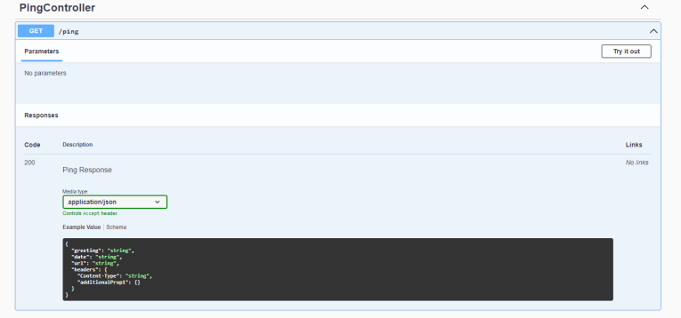
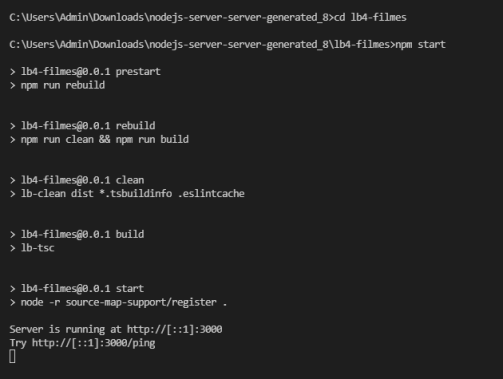
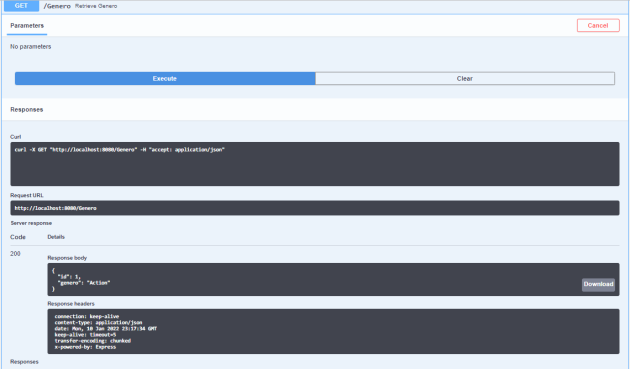
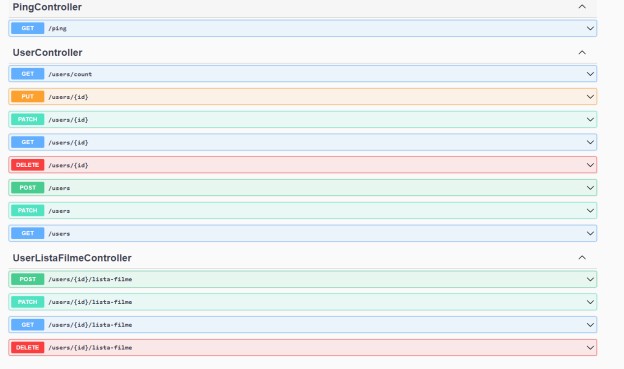
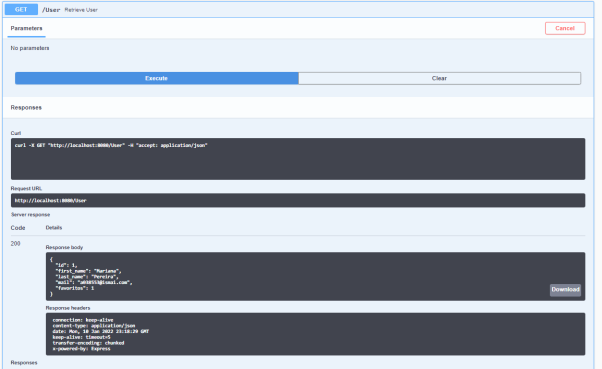
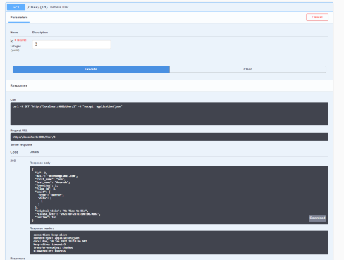
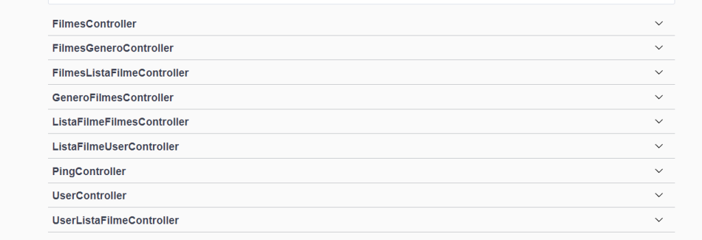
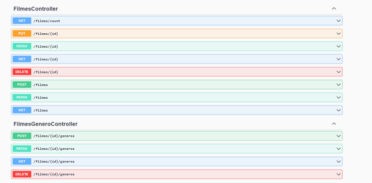
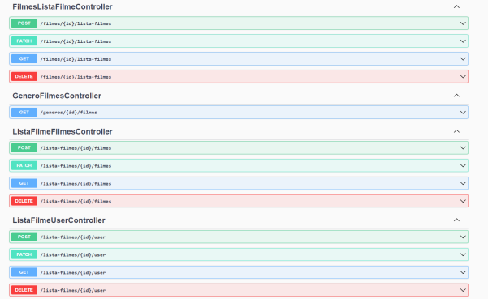
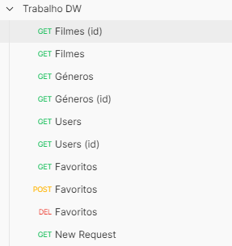

# C4 : Apresentação

_Add here the presentation elements. Be creative._

## Introdução
_Esta API tem como âmbito o desenho e criação de um serviço web que permite a consulta de informação de filmes._
_Para além da consulta de filmes também é possível ver a lista dos gêneros, users e os filmes favoritos de cada user._

## Recursos 
_Foram usados 4 recursos:_
* Filmes
* Genero
* User
* Favoritos 

_Em cada recurso estão implementados os verbos (métodos) do protocolo HTTP._

#### Recurso - Filmes
| Métodos                      | Caminho   | Resultado    |
| ---------------------------- | ----------- | -----------  |
| GET | /Filmes                |        |
| GET | /Filmes/{id}            |        |

#### Recurso - Genero
| Métodos                      | Caminho   | Resultado    |
| ---------------------------- | ----------- | -----------  |
| GET | /Genero                |        |
| GET | /Genero/{id}            |        |

#### Recurso - User
| Métodos                      | Caminho   | Resultado    |
| ---------------------------- | ----------- | -----------  |
| GET | /User               |        |
| GET | /User/{id}            |        |

#### Recurso - Favoritos
| Métodos                      | Caminho   | Resultado    |
| ---------------------------- | ----------- | -----------  |
| GET | /Favoritos/{fav}                |        |
| POST | /Favoritos/{fav}{id_filme}            |        |
| DELETE | /Favoritos/{fav}{id_filme}            |        |

## Postman
_Criação de uma 'Collection' no Portman._

## Docker

_o multicontainer está finalizado, é constituido por um container de node.js e outro de MySQL. Embora esteja finalizado a conexão do node.js à base de dados não se realiza. Já a conexão do MySQL em si não tem problemas._

## ERROS
_Quando fazemos o GET sem requisitos só faz display do primeiro mas se formos ao terminal do VS Code mostra todos._

_O GET dos Favoritos está a dar erro como é possivel ver na imagem acima._

_O POST e DELETE diz que não temos permissões para o executar._

_A conexão do node.js ao MySQL não se realiza._

## Conclusão
Com este trabalho conseguimos desenvolver a matéria lecionada na cadeira de Desenvolvimento Web I, aplicando a mesma num trabalho prático de desenvolvimento de uma aplicação e serviços web, usando GET's, POST's e DELETE's nos recursos do trabalho. O maior problema encontrado na realização do trabalho foi a utilização do Docker.

---  
[< Previous](c3.md) | [^ Main](../../../) | Next >
:--- | :---: | ---: 
